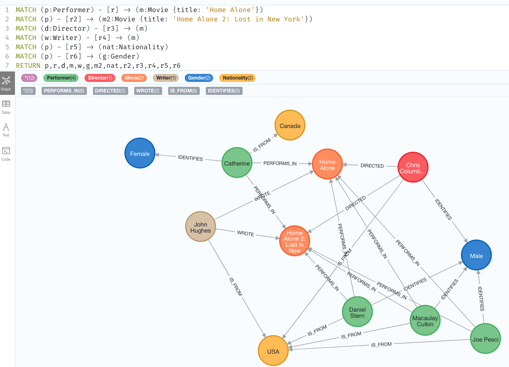
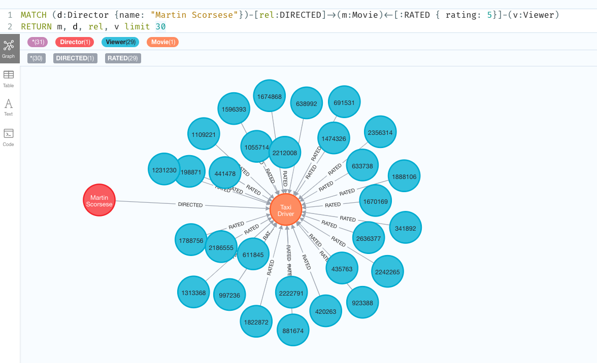
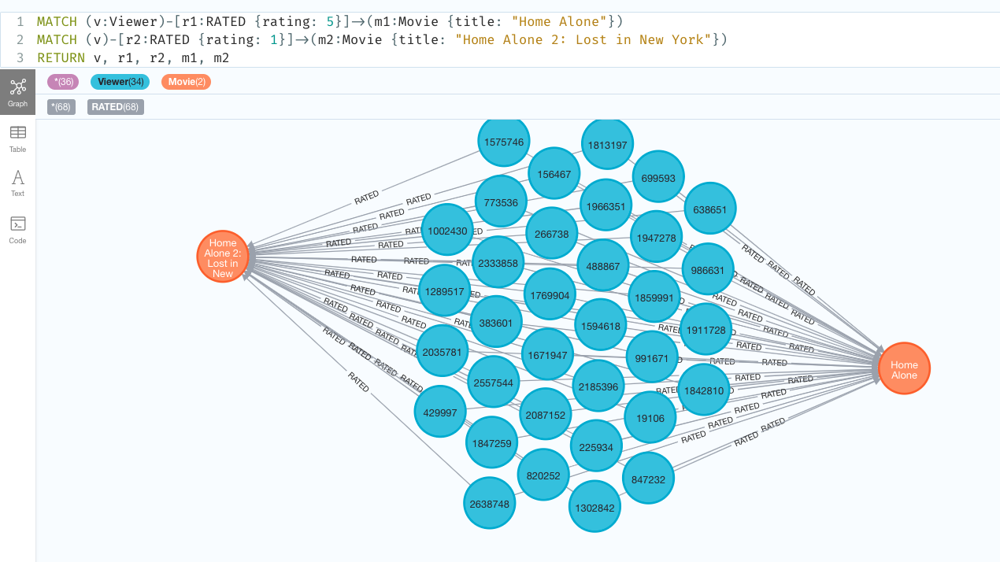
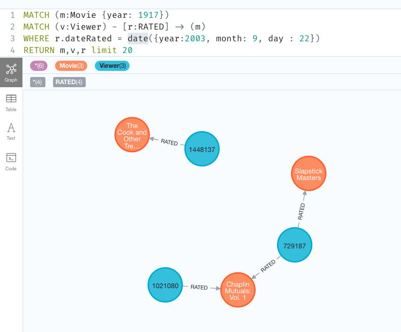
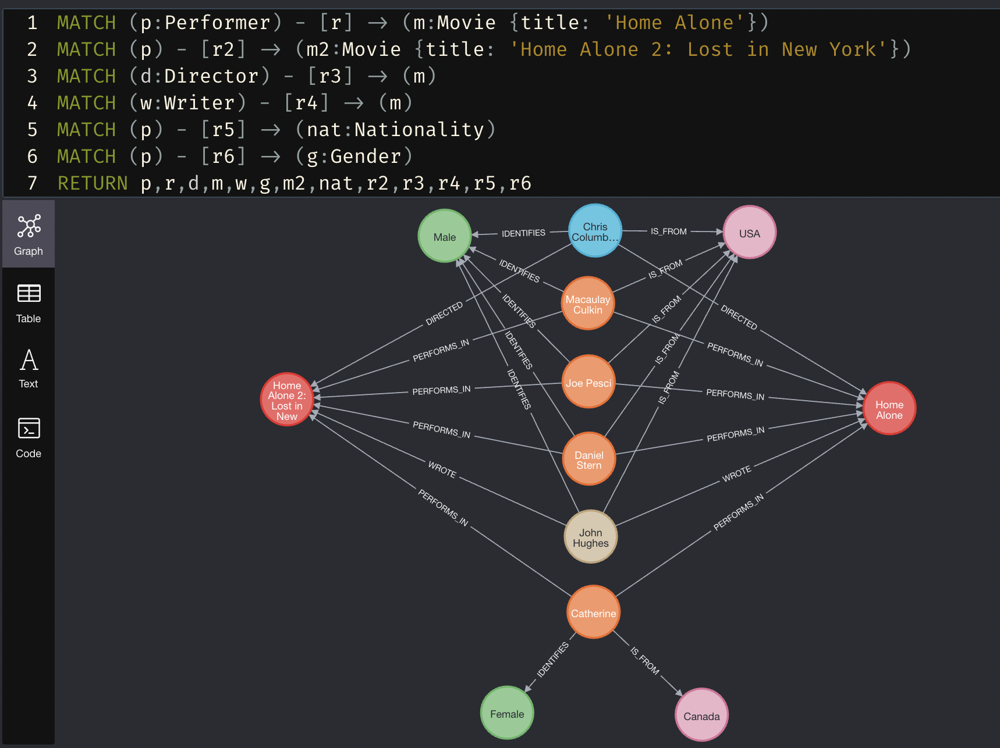

# Netflix Practice

## Queries

### Create new nodes and relationships: Do some IMDB/Wikipedia research on your choice of artists (performers, directors, writers, musicians, etc.) who are affiliated with movies/shows in the Netflix dataset and connect them to those shows’ nodes with appropriate relationships. Pick a mix—around five (5) such nodes will be good, and make sure they have movies/shows in common, in different combinations. Research and define a small set of common properties for those artists, such as gender, birthdate, nationality, etc. Show the MATCH/CREATE/RETURN clauses that make these additions and a culminating query that produces a graph showing all of your additions and the movies/shows that they worked on (but no ratings—that would be too much).

```sql
-- Create Nodes
CREATE (artist:Director{name: "Chris Columbus"});
CREATE (artist:Director{name: "Martin Scorsese"});
CREATE (artist:Director{name: "Edgar Wright"});
CREATE (artist:Director{name: "Steven Spielberg"});

CREATE (artist:Writer{name: "John Hughes"});

CREATE (artist:Performer{name: "Joe Pesci"});
CREATE (artist:Performer{name: "Daniel Stern"});
CREATE (artist:Performer{name: "Macaulay Culkin"});
CREATE (artist:Performer{name: "Catherine OHara"});


CREATE (artist:Nationality{country: "USA"});
CREATE (artist:Nationality{country: "Canada"});
CREATE (artist:Nationality{country: "UK"});

CREATE (artist:Gender{name: "Male"});
CREATE (artist:Gender{name: "Female"});
CREATE (artist:Gender{name: "Non-Binary"});
```

```sql
--Directed
MATCH (artist:Director {name: "Chris Columbus"})
MATCH (m:Movie {title:"Home Alone"})
CREATE (artist)-[rel:DIRECTED]->(m);

MATCH (artist:Director {name: "Chris Columbus"})
MATCH (m:Movie {title:"Home Alone 2: Lost in New York"})
CREATE (artist)-[rel:DIRECTED]->(m);

MATCH (artist:Director {name: "Chris Columbus"})
MATCH (m:Movie {title:"Mrs. Doubtfire"})
CREATE (artist)-[rel:DIRECTED]->(m);

MATCH (artist:Director {name: 'Martin Scorsese'})
MATCH (m:Movie {title:"Taxi Driver", year: 1976})
CREATE (artist)-[rel:DIRECTED]->(m);

--Wrote
MATCH (artist:Writer {name: "John Hughes"})
MATCH (m:Movie {title:"Home Alone"})
CREATE (artist)-[rel:WROTE]->(m);

MATCH (artist:Writer {name: "John Hughes"})
MATCH (m:Movie {title:"Home Alone 2: Lost in New York"})
CREATE (artist)-[rel:WROTE]->(m);

--Performed_In
--Can get away without specifying performers because all performers are in home alone 1 and 2
MATCH (artist:Performer)
MATCH (m:Movie {title:"Home Alone"})
CREATE (artist)-[rel:PERFORMS_IN]->(m);

MATCH (artist:Performer)
MATCH (m:Movie {title:"Home Alone 2: Lost in New York"})
CREATE (artist)-[rel:PERFORMS_IN]->(m);

--Identifies

MATCH (artist:Director {name: 'Chris Columbus'})
MATCH (g:Gender {name: "Male"})
CREATE (artist)-[rel:IDENTIFIES]->(g);

MATCH (artist:Director {name: 'Edgar Wright'})
MATCH (g:Gender {name: "Male"})
CREATE (artist)-[rel:IDENTIFIES]->(g);

MATCH (artist:Director {name: 'Steven Spielberg'})
MATCH (g:Gender {name: "Male"})
CREATE (artist)-[rel:IDENTIFIES]->(g);

MATCH (artist:Writer {name: 'John Hughes'})
MATCH (g:Gender {name: "Male"})
CREATE (artist)-[rel:IDENTIFIES]->(g);

MATCH (artist:Performer {name: 'Joe Pesci'})
MATCH (g:Gender {name: "Male"})
CREATE (artist)-[rel:IDENTIFIES]->(g);

MATCH (artist:Performer {name: 'Daniel Stern'})
MATCH (g:Gender {name: "Male"})
CREATE (artist)-[rel:IDENTIFIES]->(g);

MATCH (artist:Performer {name: 'Macaulay Culkin'})
MATCH (g:Gender {name: "Male"})
CREATE (artist)-[rel:IDENTIFIES]->(g);

MATCH (artist:Director {name: 'Martin Scorsese'})
MATCH (g:Gender {name: "Male"})
CREATE (artist)-[rel:IDENTIFIES]->(g);

MATCH (artist:Performer {name: 'Catherine OHara'})
MATCH (g:Gender {name: "Female"})
CREATE (artist)-[rel:IDENTIFIES]->(g);

-- Is_From

MATCH (artist:Director {name: 'Chris Columbus'})
MATCH (n:Nationality {country: "USA"})
CREATE (artist)-[rel:IS_FROM]->(n);

MATCH (artist:Director {name: 'Edgar Wright'})
MATCH (n:Nationality {country: "UK"})
CREATE (artist)-[rel:IS_FROM]->(n);

MATCH (artist:Director {name: 'Steven Spielberg'})
MATCH (n:Nationality {country: "USA"})
CREATE (artist)-[rel:IS_FROM]->(n);

MATCH (artist:Writer {name: 'John Hughes'})
MATCH (n:Nationality {country: "USA"})
CREATE (artist)-[rel:IS_FROM]->(n);

MATCH (artist:Performer {name: 'Joe Pesci'})
MATCH (n:Nationality {country: "USA"})
CREATE (artist)-[rel:IS_FROM]->(n);

MATCH (artist:Performer {name: 'Daniel Stern'})
MATCH (n:Nationality {country: "USA"})
CREATE (artist)-[rel:IS_FROM]->(n);

MATCH (artist:Performer {name: 'Macaulay Culkin'})
MATCH (n:Nationality {country: "USA"})
CREATE (artist)-[rel:IS_FROM]->(n);

MATCH (artist:Director {name: 'Martin Scorsese'})
MATCH (n:Nationality {country: "USA"})
CREATE (artist)-[rel:IS_FROM]->(n);

MATCH (artist:Performer {name: 'Catherine OHara'})
MATCH (n:Nationality {country: "Canada"})
CREATE (artist)-[rel:IS_FROM]->(n);
```

```sql
-- Actual Query
MATCH (p:Performer) - [r] -> (m:Movie {title: 'Home Alone'})
MATCH (p) - [r2] -> (m2:Movie {title: 'Home Alone 2: Lost in New York'})
MATCH (d:Director) - [r3] -> (m)
MATCH (w:Writer) - [r4] -> (m)
MATCH (p) - [r5] -> (nat:Nationality)
MATCH (p) - [r6] -> (g:Gender)
RETURN p,r,d,m,w,g,m2,nat,r2,r3,r4,r5,r6
```

<center></img></center>

> Creates nodes for directors, writers, performers, nationalities, and genders. Creates relationships between said nodes, corresponding to which director directed which movie, which writer wrote which film, which performer performed in which movie, which country each entity originates from, and which gender each entity identifies as. Graphs the relationships between Performers, Directors, and Writers of the movies "Home Alone" and "Home Alone 2: Lost in New York". These relationships include Performs_In, Wrote, Directs, Is_From, and Identifies.

### Viewers who are fans: Let’s define a “fan” as someone who has rated a movie/show with a 5. Formulate a query that graphs the viewers who have given a 5 rating to the work of one of your selected artists. Make sure to return the viewers, the movies/shows that they rated, your chosen artist, and what they did in those movies/shows.

```json
MATCH (d:Director {name: "Martin Scorsese"})-[rel:DIRECTED]->(m:Movie)<-[:RATED { rating: 5}]-(v:Viewer)
RETURN m, d, rel, v
LIMIT 30
```

<center></img></center>

> Returns a graph of all the viewers who rated movies with the relation DIRECTED by Martin Scorsese, as well as Martin Scorsese's relation with the movie.

### Love/hate relationship: Pick two movies that are likely to have a decent overlap of viewers. Formulate a query that graphs the viewers who hated one movie (rated it a 1) but loved the other (rated it a 5).

```json
MATCH (v:Viewer)-[r1:RATED {rating: 5}]->(m1:Movie {title: "Home Alone"})
MATCH (v)-[r2:RATED {rating: 1}]->(m2:Movie {title: "Home Alone 2: Lost in New York"})
RETURN v, r1, r2, m1, m2
```

<center></img></center>

> Returns a graph of users who rated Home Alone 1 a "5" and rated Home Alone 2 a "1" as well as ther "Rated" relations to their corresponding movie.

### Watch party 1: Define a set of criteria that filters out a small subset of movies/shows (no more than 3 to be safe). Formulate a query that produces a graph showing viewers who rated those movies/shows on the same day.

```json
MATCH (m:Movie {year: 1917})
MATCH (v:Viewer) - [r:RATED] -> (m)
WHERE r.dateRated = date({year:2003, month: 9, day : 22})
RETURN m,v,r
```

<center></img></center>

> Returns a graph of movies in the dataset released in 1917 with all the viewers who rated the movies on the same day.

### Watch party 2: Define a set of criteria that filters out a small subset of the artists that you’ve loaded into Neo4j. Formulate a query that produces a graph showing viewers who rated a movie/show on the same day, for movies/shows that your chosen artists worked on. Make sure to return the viewers, the movies/shows that they rated, the chosen artists, and what they did in those movies/shows.

```json
MATCH (d:Director {name: "Chris Columbus"})-[rel:DIRECTED]->(m:Movie)
MATCH (v:Viewer) - [r:RATED] -> (m)
WHERE r.dateRated = date({year:2003, month: 9, day : 22})
RETURN m,v,r,d,rel
```

<center></img></center>

> Returns a graph of movies in the dataset directed by Chris Columbus with all the viewers who rated the movies on the same day.
