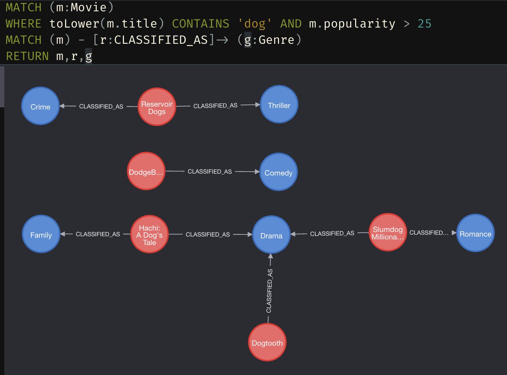
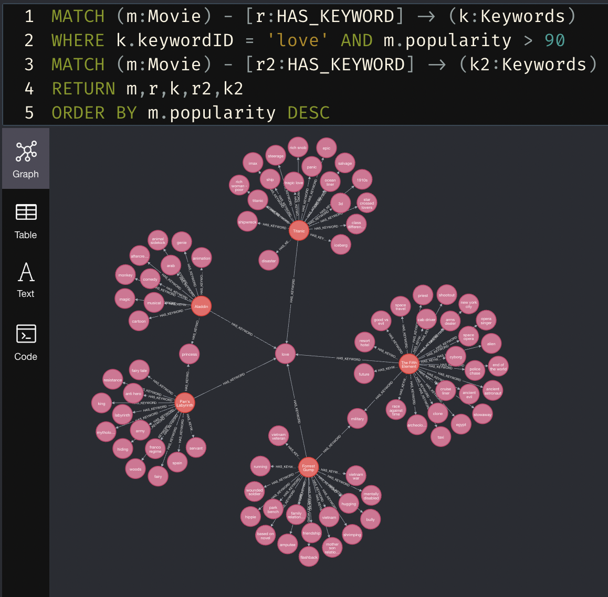
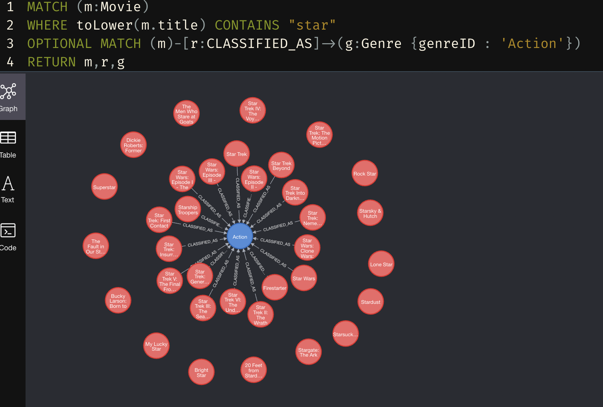
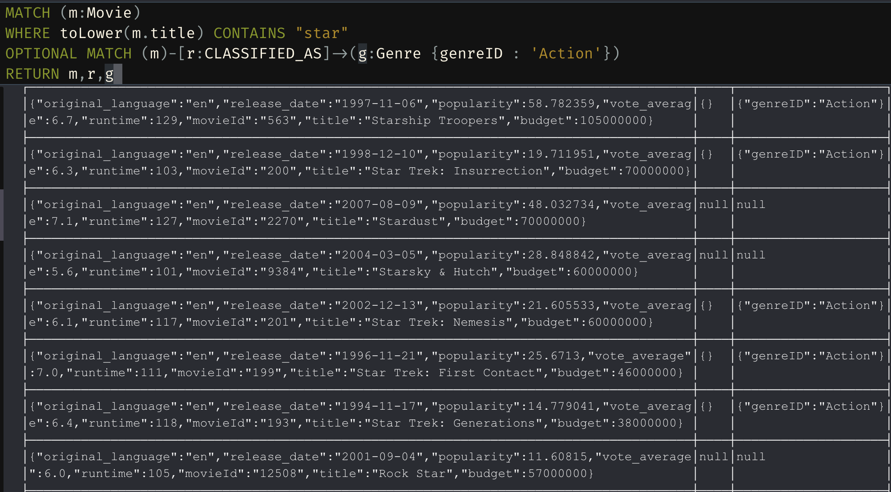
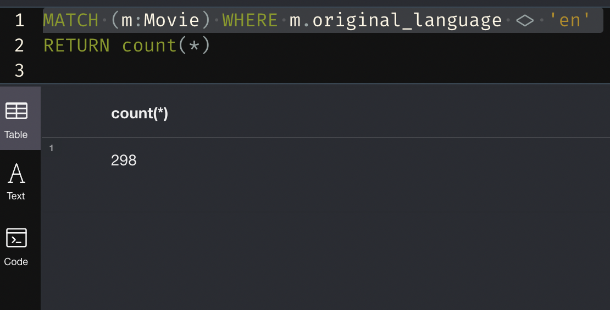
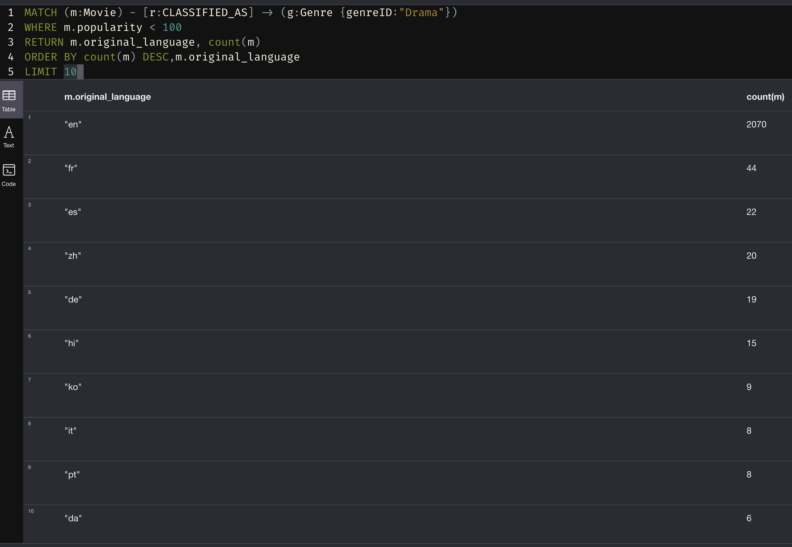
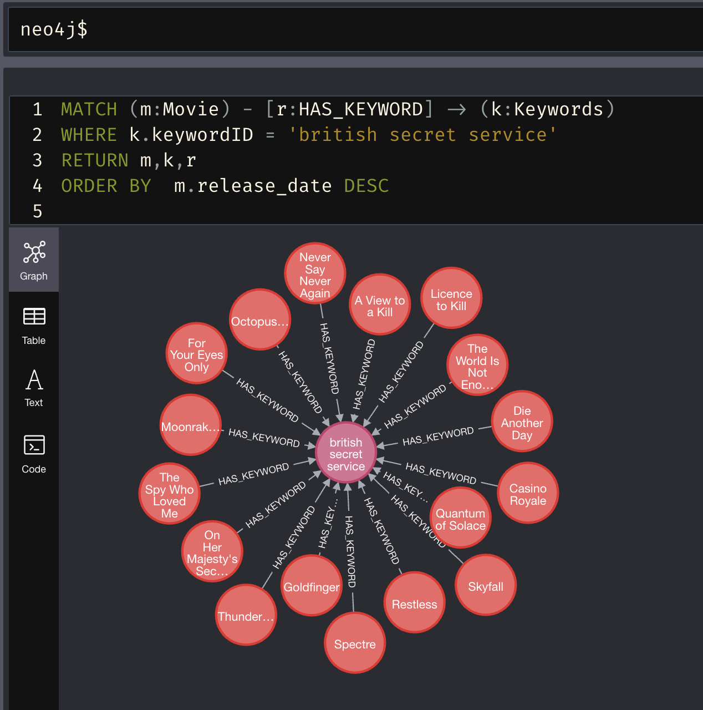
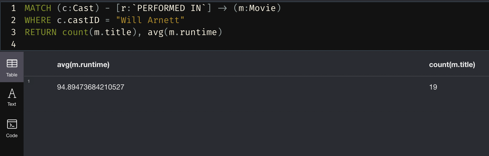

## Show off your ability to derive graphs from your database by writing the following Cypher queries. For each query, use the format given in the NodeFlix section where you:

## State what the query/statement is asking or doing in English

Provide the Neo4j Cypher query/statement that yields those results
Include a screenshot of this query/statement being issued and the graph that it produces
Submit these in a Markdown file called queries.md. All queries should be domain-appropriate—i.e., they should make sense for an application that is trying to do real-world work with your adopted dataset:

### A query that matches a meaningful subgraph in your dataset

```json
MATCH (m:Movie)
WHERE toLower(m.title) CONTAINS 'dog' AND m.popularity > 25
MATCH (m) - [r:CLASSIFIED_AS] -> (g:Genre)
RETURN m,r,g
```

<center></img></center>

> Returns a subgraph of movies that contain the word 'dog' (case insensitive) with a popularity of more than 25. Returns the graph of the relationship between those movies and their genres.

### Another such query, involving a different set of nodes, properties, and relationships

```
MATCH (m:Movie) - [r:HAS_KEYWORD] -> (k:Keywords)
WHERE k.keywordID = 'love' AND m.popularity > 90
MATCH (m:Movie) - [r2:HAS_KEYWORD] -> (k2:Keywords)
RETURN m,r,k,r2,k2
ORDER BY m.popularity DESC
```

<center></img></center>

> Returns a subgraph of movies all share the keyword "love", and have a popularity of over 90, then returns all rest of the keywords of the movies that match those properties and their relationships to the movie.

### A query that matches a meaningful subgraph then optionally matches more relationships/nodes (i.e., the query returns all nodes in the first subgraph even if they don’t match the second pattern)

```
MATCH (m:Movie)
WHERE toLower(m.title) CONTAINS "star"
OPTIONAL MATCH (m)-[r:CLASSIFIED_AS]->(g:Genre {genreID : 'Action'})
RETURN m,r,g
```

<center></img></center>
<center></img></center>

> Returns a graph of all movies with 'star' in the title, and optionally graphs the movies with the genre 'Action'. The graph contains the movie titles and the Action node. Also I included a picture of the table to show the null relationships.

### An overall aggregate query that provides counts or other aggregate computations for an overall set of pattern-matched nodes or edges (this one will not return a graph)

```
MATCH (m:Movie)
WHERE m.original_language <> 'en'
RETURN COUNT(*)
```

<center></img></center>

> Returns a count of all movies in our dataset who's original language is not english.

### A grouped aggregate query that provides counts or other aggregate computations for groupings derived from pattern-matched nodes or edges (this one will not return a graph)

```
MATCH (m:Movie) - [r:CLASSIFIED_AS] -> (g:Genre {genreID:"Drama"})
WHERE m.popularity < 100
RETURN m.original_language, count(m)
ORDER BY count(m) DESC,m.original_language
LIMIT 10
```

<center></img></center>

> An aggregate count of all movies by original language that are in the genre "Drama" and have a popularity of under 100. We then order the aggregation by the count (descending), and in the case of a tie, by the language code, limited to the top 10.

### Another Query from 1-3

```
MATCH (m:Movie) - [r:HAS_KEYWORD] -> (k:Keywords)
WHERE k.keywordID = 'british secret service'
RETURN m,k,r
ORDER BY  m.release_date DESC
```

<center></img></center>

> Returns a graph of all movies who share the keyword "british secret service" and in turn show all the James Bond films in our dataset. We order them by descending release date which can be seen in the table view

### Another Query from 4-5

```
MATCH (c:Cast) - [r:`PERFORMED IN`] -> (m:Movie)
WHERE c.castID = "Will Arnett"
RETURN avg(m.runtime), count(m.title)
```

<center></img></center>

> Returns the count of movies and the average runtime of the moves where Will Arnett was a cast member
